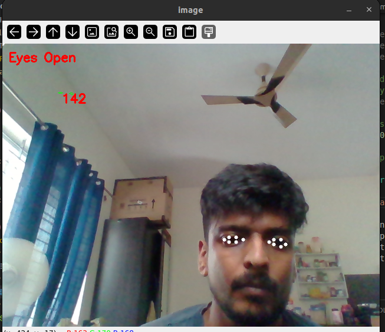

Driver Monitoring system 
IIT-Jammu , project for ML course .
- Chris Sunny Thaliyath
- Quadri Syed Mujtaba,
- Shalin Saleem


## Installation

This projects runs on Python 3.9 with the following libraries:

- numpy
- OpenCV (opencv-python)
- mediapipe

https://virtualenv.pypa.io/en/latest/user_guide.html

```
pip3 install virtualenv
```

```
virtualenv dms_env
source dms_env/bin/activate
```

You can use the requirements.txt file provided in the repository using:
    
    pip install -r requirements.txt
    
Or you can execute the following pip commands on terminal:

```
pip install numpy
pip install opencv-python
pip install mediapipe
```


## HOW TO RUN 


### EYE_BLINK detection

- Each frame is processed to detect faces using the detector object.
- For each detected face, facial landmarks are extracted using the predictor object.
- The eye aspect ratio (EAR) is computed for both eyes and averaged.
- Contours are drawn around the eyes based on the computed landmarks.
- If the EAR falls below a threshold (indicating closed eyes), a drowsiness alert is triggered.
- The script keeps track of consecutive frames where eyes remain closed (total variable).
- If the total exceeds a threshold, a drowsiness alert is displayed on the frame.

```
#this will download the dlib model from the artifactory and store it locally
sh scripts/download_dlib.sh
# to run the python script
python3 main/eye_blink.py
```





Docs link
https://docs.google.com/document/d/1kXB_yZaSI_i0QZ1pxWHBYDS8_8odYn6kibB0ezmjVFc/edit?usp=sharing
